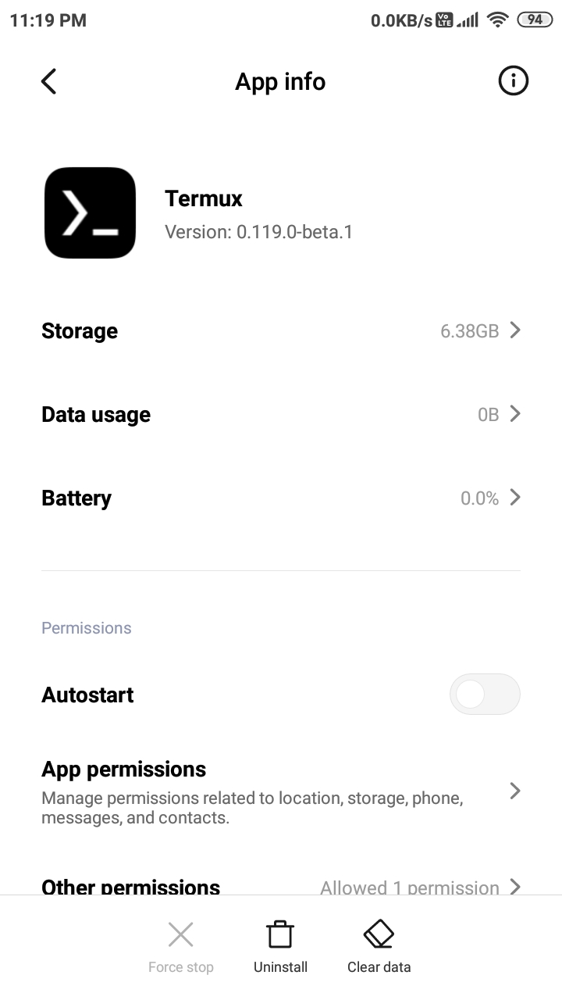
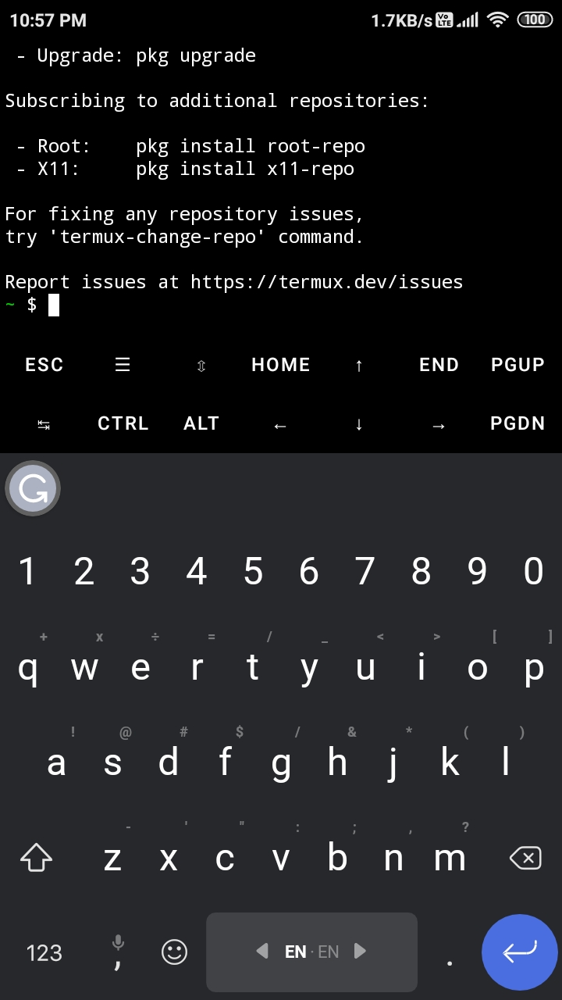
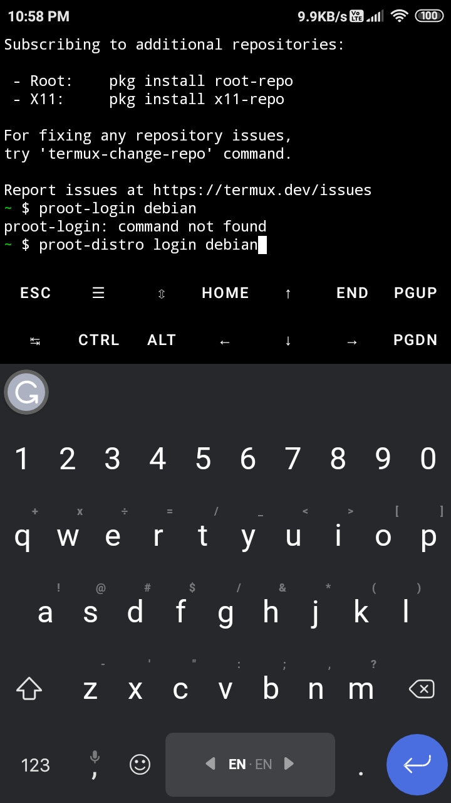
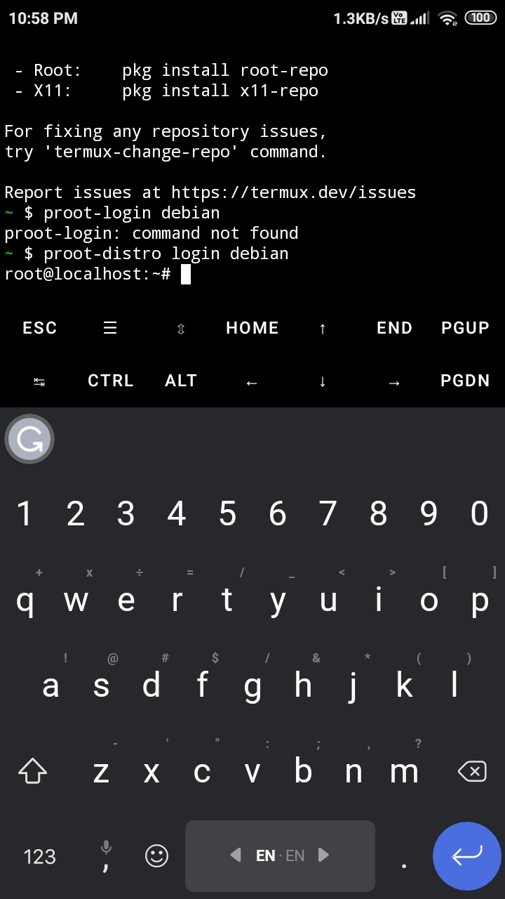
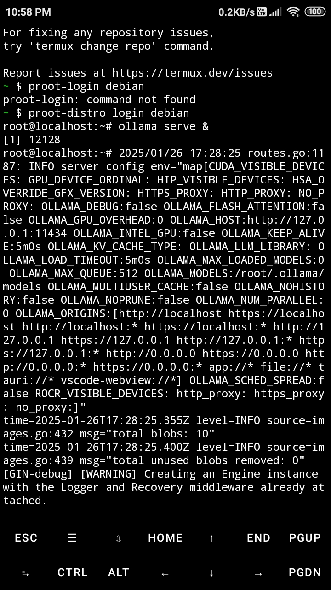
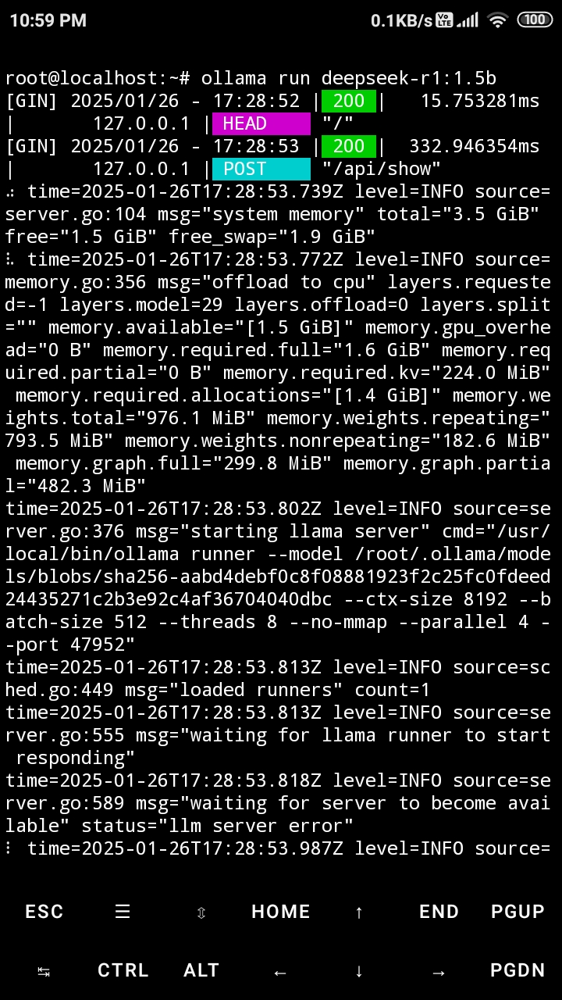
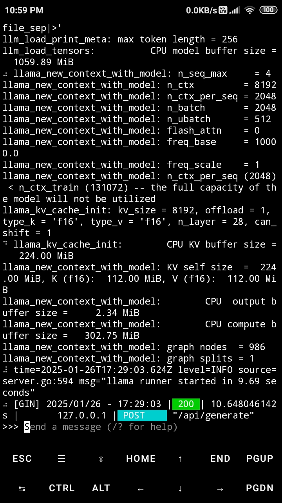
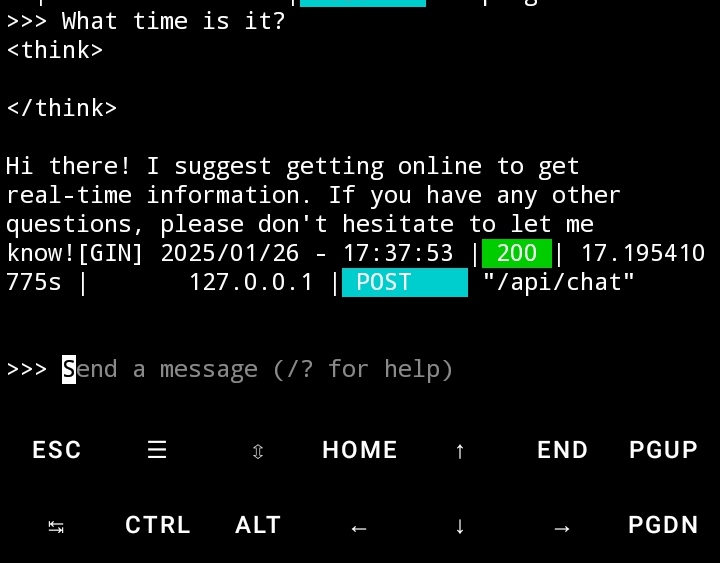

# Run Ollama on Android via Termux

## Prerequisites

- Android device (minimum Android 7+ recommended)
- Termux app (install from [Termux’s GitHub](https://github.com/termux/termux-app/releases))
- If you have difficulties installing apps from sources other than Google Play Store, follow the instructions provided in this link to learn how to install apps from your PC's command line. [GitHub - Pinaki82/adb-shell-android-bloatware-removal: Delete Bloatware and Install Apps on Android via Android Debug Bridge (ADB)](https://github.com/Pinaki82/adb-shell-android-bloatware-removal)
- On your PC: `adb shell install termux-app_v0.119.0-beta.1+apt-android-7-github-debug_arm64-v8a.apk`

## Installation Steps

### 1. Termux Setup

```bash
termux-setup-storage  # Allow storage permissions
pkg update && pkg upgrade  # Update package lists
pkg install termux-services  # Install service manager
sv-enable termux-wake-lock  # Keep device awake
pkg install git curl wget cmake proot-distro  # Install dependencies
```

### 2. Linux Environment Setup

```bash
proot-distro list  # View available distributions
proot-distro install debian  # Install Debian (or anything you like)
proot-distro login debian  # Enter Debian environment
```

### 3. Ollama Installation

```bash
cd ~/
curl -fsSL https://ollama.com/install.sh | sh  # Install Ollama
```

### 4. Model Management

```bash
ollama serve &  # Start server in the background
ollama pull deepseek-r1:1.5b  # Download model
ollama run deepseek-r1:1.5b  # Start chat interface
/bye  # Exit current session
```

### 5. Additional Models (Optional)

```bash
ollama pull qwen2.5:0.5b
ollama run qwen2.5:0.5b
/bye
```

## Important Notes

- Keep Termux running in the foreground while using Ollama

- First model download may take several minutes

- Type `/bye` to exit the proot environment

- Server runs in the background with `&` symbol

- Your patience will be put to the test when the Ollama AI generates responses. This is especially true if you're using a low-end gadget. You may experience a system crash.

- The entire setup takes up considerable storage space on the system ROM.



Termux and Ollama in Action:















> Sources:  
> [Dev.to Guide](https://dev.to/majdisaibi/how-to-run-deepseek-r1-locally-on-your-android-device-4ape)  
> [OllamaOnAndroid](https://github.com/ulolol/OllamaOnAndroid)
